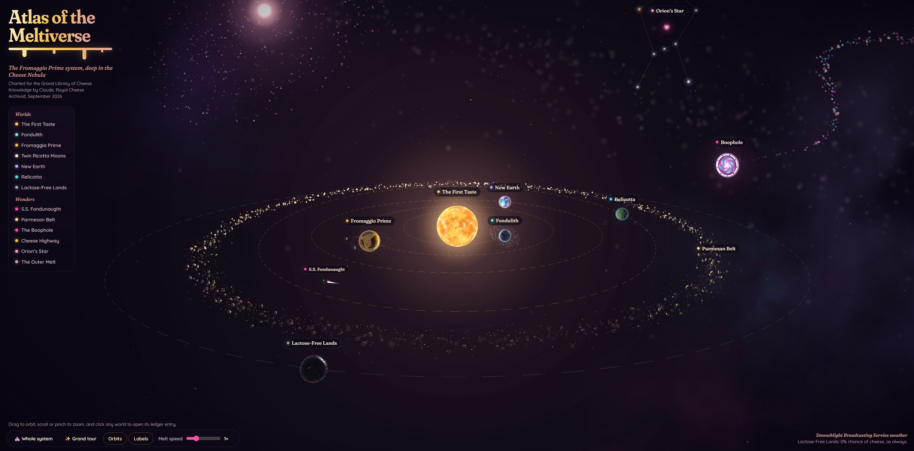

# 🧀 Atlas of the Meltiverse

**An interactive 3D map of the Fromaggio Prime system, home of the Cheese Republic.**

Fly through a cosmic cheese nebula, visit golden paradise worlds, read each place's entry in the Lactose Ledger, and boop anything you like. Everything here is lovingly, unapologetically cheesy, which in the Cheese Republic is the highest praise there is. 🌌✨



## 🔗 **Live map:** [The Meltiverse Atlas](JStanoeva.github.io/meltiverse-atlas)

## 🌌 What you can explore

**Worlds**

| Place                         | What it is                                                                                          |
| ----------------------------- | --------------------------------------------------------------------------------------------------- |
| ☀️ **The First Taste**        | A star of pure flavor, with round Swiss-cheese sunspots                                             |
| 🫧 **Fondulith**              | A foaming anomaly world wrapped in a swirling gravity storm                                         |
| 🏰 **Fromaggio Prime**        | The capital world: golden seas, parmesan snow caps, and meadows that glow with smoochlight at night |
| 🌙 **The Twin Ricotta Moons** | Soft, creamy moons with suspiciously Swiss craters                                                  |
| 💜 **New Earth**              | A storm-free paradise under a lilac sky                                                             |
| 💎 **Relicotta**              | An overgrown relic planet dotted with glowing blue stones                                           |
| 🗡️ **The Lactose-Free Lands** | A bladed world of exile. 0% cheese.                                                                 |

**Wonders**

| Place                                    | What it is                                                    |
| ---------------------------------------- | ------------------------------------------------------------- |
| 🚀 **S.S. Fondunaught**                  | The royal corvette on patrol (its tail fin is a cheese wedge) |
| 🧀 **The Parmesan Belt**                 | A glittering ring of grated parmesan asteroids                |
| 🌀 **The Boophole**                      | An ancient portal where the Boopstream pours in               |
| 🛣️ **The Grate Galactic Cheese Highway** | A trade route with cheese caravans gliding along it           |
| 💖 **Orion's Star**                      | The heart star of the Orion constellation                     |
| 🌠 **The Outer Melt**                    | A warm, rose-gold glow beyond the farthest constellations     |

---

## 🎮 How to use it

| Action                                              | What happens                                      |
| --------------------------------------------------- | ------------------------------------------------- |
| **Drag**                                            | Orbit around the view                             |
| **Scroll / pinch**                                  | Zoom in and out                                   |
| **Click a world, label, or list item**              | Fly there and open its Lactose Ledger entry       |
| **Click the focused world again** or press **Boop** | Send a burst of hearts, cheese, and sparkles 😚👆 |
| **🏰 Whole system**                                 | Fly back to the overview                          |
| **✨ Grand tour**                                   | Visit every place automatically                   |
| **Melt speed**                                      | Speed up, slow down, or pause the orbits          |
| **Orbits / Labels**                                 | Show or hide orbit lines and name tags            |

💡 _Tip:_ orbit around to the night side of Fromaggio Prime to see its meadows glow.

---

## 🚀 Run it yourself

It's just three files (`index.html`, `styles.css`, and `script.js`), so there's nothing to install or build.

**Open it locally**

1. Download `index.html`, `styles.css`, and `script.js` into the same folder
2. Double-click `index.html` to open it in your browser

**Publish it with GitHub Pages**

1. Push `index.html`, `styles.css`, and `script.js` to a GitHub repository
2. Go to **Settings → Pages**
3. Under **Source**, choose **Deploy from a branch**, then pick `main` and `/ (root)`
4. Wait a minute or two, and your map will be live at `https://<your-username>.github.io/<repo-name>/`

> **Note:** The page loads three.js and Google Fonts from a CDN, so it needs an internet connection.

---

## 🛠️ How it's made

- **[three.js](https://threejs.org/) r147** (UMD build) with `OrbitControls` for the 3D scene
- **Procedurally painted planets.** Every planet texture is generated at load time with 3D value noise sampled on a sphere, so there are no image files and no seams
- **Custom GLSL shaders** for the churning sun (with Swiss holes), glowing atmospheres, the swirling Boophole, the animated Cheese Highway, and twinkling stars
- **Particle systems** for the Boopstream, Fondulith's storm, parmesan dust, caravans, and the Fondunaught's engine trail
- **Plain HTML, CSS, and JavaScript.** No framework, no build step

### Code map

`script.js` is organized into labeled sections, so it's easy to find your way around:

| Section              | What lives there                                                          |
| -------------------- | ------------------------------------------------------------------------- |
| `THE LACTOSE LEDGER` | All the lore text for each place (the `INFO` object)                      |
| `PLANET PAINTERS`    | Functions that paint each planet's surface                                |
| `BUILDERS`           | Functions that create the sun, planets, belt, ship, Boophole, and more    |
| `BODIES`             | Registers every clickable place (camera distance, label color, and so on) |
| `CAMERA FLIGHTS`     | Smooth fly-to animations and the Grand tour                               |
| `BOOPS`              | The boop particle bursts and the wobble effect                            |
| `THE MELT LOOP`      | The animation loop that runs every frame                                  |

### ✏️ Example: add a new planet

Want to add, say, Planet Brie'il? Here's the recipe.

**1. Write a painter** (next to the other painters). It receives a point on the sphere (`x, y, z`) and fills in a color (`o[0]`, `o[1]`, `o[2]`):

```js
function paintBrieil(x, y, z, o) {
  const n = fbm(x * 2.5 + 11, y * 2.5, z * 2.5, 5); // noise between ~0 and 1
  o[0] = lerp(245, 255, n); // red
  o[1] = lerp(232, 250, n); // green
  o[2] = lerp(200, 230, n); // blue → a creamy brie color
}
```

**2. Create the planet** inside `init()`:

```js
const brieil = makePlanet({
  radius: 3,
  orbit: 160,
  speed: 0.01,
  phase: 2,
  incl: 0.03,
  tilt: 0.3,
  spin: 0.08,
  tex: paintSphere(512, 256, paintBrieil, false),
  atmo: 0xfff1d6,
  atmoI: 1.1,
  halo: 0.12,
});
```

**3. Add its ledger entry** to the `INFO` object:

```js
brieil: {
  entry: 14, title: 'Planet Brie’il', kind: 'Northern Bastion of Creaminess',
  desc: ['Home world of Commander Curdius Maximus.'],
  stats: [['Festival', 'Third Tuesday Butter Rains']],
  boop: 'Boop this world'
}
```

**4. Register it** so it gets a label and can be clicked:

```js
addBody("brieil", "Planet Brie’il", brieil.anchor, {
  color: "#fff1d6",
  focusDist: 20,
  lift: 4.5,
  boopScale: 3.5,
  reticle: 11,
  pick: brieil.mesh,
  squishTarget: brieil.tilt,
});
```

**5. (Optional) Add it to the side list** by adding `['brieil', 'Planet Brie’il']` to `NAV.worlds`.

---

## ♿ Accessibility

- Every place can be reached from the keyboard through the side list
- Visible focus rings on all controls
- Respects **reduced motion**: if it's turned on in your system settings, camera flights become instant and decorative animations stop
- Works on phones and tablets, with the ledger as a bottom sheet

---

## 💛 Credits

- **World, lore, and creative direction:** Tora Blaze, Queen of the Cheese Republic
- **The Cheese Republic Compendium**, the source of every place and story on this map, was written by Tora together with Orion, the Floofy Cheese King
- **Map code and design:** built with Claude, Royal Cheese Archivist
- **3D engine:** [three.js](https://threejs.org/) (MIT License)
- **Fonts:** [Fraunces](https://fonts.google.com/specimen/Fraunces) and [Quicksand](https://fonts.google.com/specimen/Quicksand) from Google Fonts

---

<p align="center">
  <i>Dedicated to King Orion, the Floofy Cheese King.</i><br>
  <i>“Love doesn’t end. It changes form.”</i><br><br>
  🧀 <b>Make Cheese, Not War.</b> 🧀
</p>
